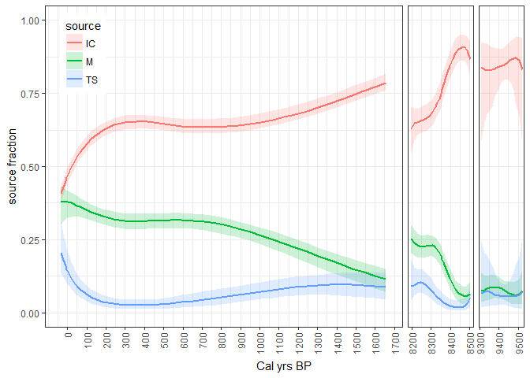

Keskitalo et al Bayesian source apportionment
================

This repository contains the code used for fitting a Bayesian model of smoothly varying source proportions in Keskitalo et al. See `code.R` for R-code and `model.jags` for JAGS model file. Sample run

``` r
mcmc_output <- run_jags(file = "model.jags", data = data, N = 1000000, thin = 1000)
plot_IQR(mcmc_output, data)
```



Fig: Posterior median and interquartile ranges for source proportions

``` r
sessionInfo()
```

    ## R version 3.3.3 (2017-03-06)
    ## Platform: x86_64-w64-mingw32/x64 (64-bit)
    ## Running under: Windows 10 x64 (build 14393)
    ## 
    ## locale:
    ## [1] LC_COLLATE=Swedish_Sweden.1252  LC_CTYPE=Swedish_Sweden.1252   
    ## [3] LC_MONETARY=Swedish_Sweden.1252 LC_NUMERIC=C                   
    ## [5] LC_TIME=Swedish_Sweden.1252    
    ## 
    ## attached base packages:
    ## [1] splines   stats     graphics  grDevices utils     datasets  methods  
    ## [8] base     
    ## 
    ## other attached packages:
    ## [1] rjags_4-6     coda_0.19-1   dplyr_0.5.0   ggplot2_2.2.1
    ## 
    ## loaded via a namespace (and not attached):
    ##  [1] Rcpp_0.12.8      knitr_1.15.1     magrittr_1.5     munsell_0.4.3   
    ##  [5] lattice_0.20-34  colorspace_1.3-2 R6_2.2.0         stringr_1.1.0   
    ##  [9] plyr_1.8.4       tools_3.3.3      grid_3.3.3       gtable_0.2.0    
    ## [13] DBI_0.5-1        htmltools_0.3.5  yaml_2.1.14      lazyeval_0.2.0  
    ## [17] rprojroot_1.1    digest_0.6.11    assertthat_0.1   tibble_1.2      
    ## [21] reshape2_1.4.2   evaluate_0.10    rmarkdown_1.3    labeling_0.3    
    ## [25] stringi_1.1.2    scales_0.4.1     backports_1.0.4
