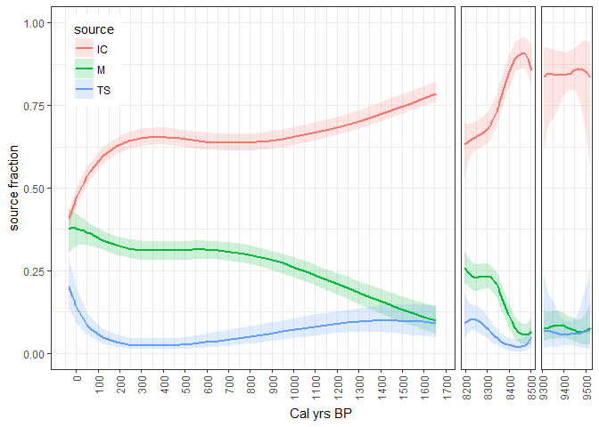

Keskitalo et al Bayesian source apportionment
================

``` r
source("code.R")
```

    ## Loading tidyverse: ggplot2
    ## Loading tidyverse: tibble
    ## Loading tidyverse: tidyr
    ## Loading tidyverse: readr
    ## Loading tidyverse: purrr
    ## Loading tidyverse: dplyr

    ## Conflicts with tidy packages ----------------------------------------------

    ## filter(): dplyr, stats
    ## lag():    dplyr, stats

    ## Loading required package: coda

    ## Linked to JAGS 4.2.0

    ## Loaded modules: basemod,bugs

``` r
data<-read.csv("data.csv", sep=";", dec=",", header = FALSE)
colnames(data) <- c("depth", "D14C", "d13C", "year", "sd")
```

This repository contains the code used for fitting a Bayesian model of smoothly varying source proportions in Keskitalo et al.

``` r
mcmc_output <- run_jags(file = "model.jags", data = data, N = 1000000, thin = 1000)
plot_IQR(mcmc_output, data)
```

    ## Warning: Removed 1 rows containing missing values (geom_point).


